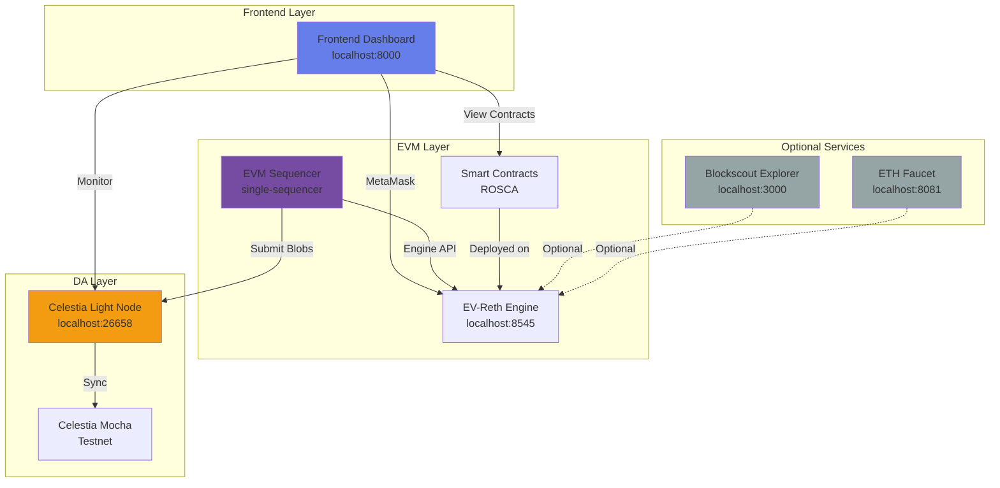
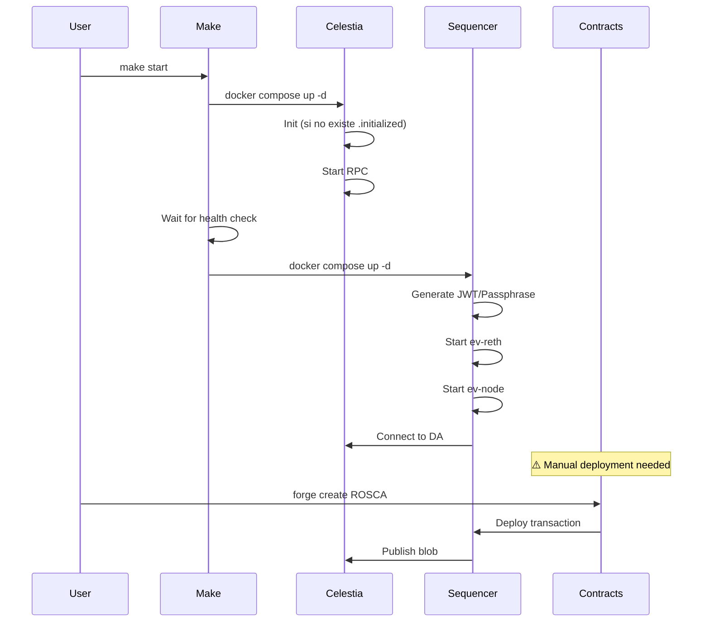
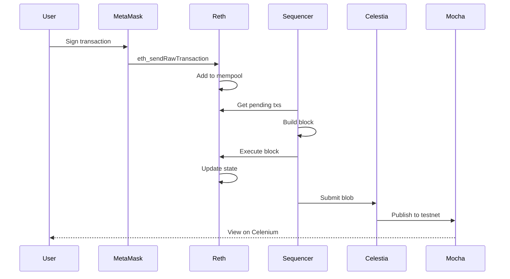
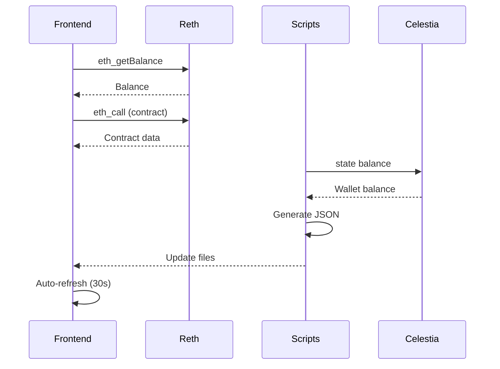

# Arquitectura del Sistema Evolve-Deployment

## Visión General

Evolve-Deployment es un stack completo para desarrollo local de aplicaciones EVM con capa de disponibilidad de datos (DA) en Celestia. El sistema permite ejecutar un secuenciador EVM local que publica datos en la testnet Mocha de Celestia.



## Componentes del Sistema

### 🔵 Core Components (Necesarios)

#### 1. Celestia DA Light Node (`stacks/da-celestia`)

**Propósito:** Nodo ligero de Celestia que se conecta a la testnet Mocha para publicar y recuperar datos.

**Características:**
- Conecta a Core público: `rpc-mocha.pops.one:9090`
- Expone RPC en puerto `26658`
- Usa autenticación deshabilitada (`--rpc.skip-auth`) solo para desarrollo
- Sincroniza desde altura confiable configurada en `.env`

**Configuración Clave:**
```env
DA_CORE_IP=rpc-mocha.pops.one
DA_CORE_PORT=9090
DA_TRUSTED_HEIGHT=9223117  # Debe actualizarse periódicamente
DA_TRUSTED_HASH=1E5F219CF278886986F1B612C0EDABF48B96CE1B74934D4C6332C06079B09644
DA_NETWORK=mocha
```

**Volúmenes:**
- `celestia-node-data`: Datos del nodo (headers, bloques)

**Health Check:**
```bash
curl -X POST http://localhost:26658 \
  -H 'Content-Type: application/json' \
  --data '{"jsonrpc":"2.0","id":1,"method":"p2p.Info"}'
```

#### 2. EVM Sequencer Stack (`stacks/single-sequencer`)

**Propósito:** Secuenciador EVM que ejecuta transacciones y publica datos en Celestia.

**Componentes:**

##### a. EV-Reth Engine
- **Imagen:** `ghcr.io/evstack/ev-reth:v0.1.0`
- **Puerto:** `8545` (JSON-RPC), `8551` (Engine API)
- **Función:** Motor de ejecución EVM compatible con Ethereum
- **Características:**
  - Soporte completo de JSON-RPC
  - Mempool configurable (200k tx pending/queued)
  - Métricas Prometheus en puerto `9001`

##### b. EV-Node-EVM-Single
- **Imagen:** `ghcr.io/evstack/ev-node-evm-single:v1.0.0-beta.8`
- **Puerto:** `26660` (Prometheus), `7331` (API)
- **Función:** Coordinador que conecta EVM con Celestia DA
- **Características:**
  - Genera bloques cada `500ms`
  - Publica a Celestia cada `30s`
  - Manejo automático de gas y reintentos

##### c. Servicios de Inicialización
- **jwt-init-sequencer:** Genera token JWT para AuthRPC
- **passphrase-init-sequencer:** Genera passphrase para wallet del sequencer

**Configuración Clave:**
```env
CHAIN_ID=1234
SEQUENCER_DA_START_HEIGHT=8846129  # ⚠️ Debe actualizarse
SEQUENCER_DA_HEADER_NAMESPACE=0x0000000000000000000000000000000000000000010efb31c9c66913c812e1
SEQUENCER_DA_DATA_NAMESPACE=0x00000000000000000000000000000000000000000229921090553e9cd6df4d
```

**Volúmenes:**
- `ev-reth-sequencer-data`: Datos de la blockchain
- `sequencer-data`: Configuración del nodo
- `jwttoken-sequencer`: Token JWT compartido
- `passphrase-sequencer`: Passphrase del wallet
- `sequencer-export`: Datos exportados

#### 3. Frontend Dashboard (`frontend/`)

**Propósito:** Interfaz web para interactuar con contratos y monitorear el sistema.

**Características:**
- Integración con MetaMask
- Tabs para diferentes funcionalidades:
  - Integration Tests
  - Celestia Monitor
  - Create/Join/Contribute ROSCA
  - View Groups
- Auto-refresh de datos
- Visualización de métricas

**Archivos Principales:**
- `index.html`: UI del dashboard
- `app.js`: Lógica de la aplicación
- `serve.py`: Servidor HTTP simple
- `.rosca-address`: Dirección del contrato desplegado

**Dependencias:**
- ethers.js v5.7.2
- jazzicon (avatares)

#### 4. Smart Contracts (`contracts/`)

**Propósito:** Contratos inteligentes del sistema (principalmente ROSCA).

**Estructura:**
```
contracts/
├── src/
│   └── ROSCA.sol          # Contrato principal
├── script/
│   ├── DeployROSCA.s.sol  # Script de despliegue
│   └── DemoROSCA.s.sol    # Script de demo
├── test/
│   └── ROSCA.t.sol        # Tests unitarios
└── foundry.toml           # Configuración Foundry
```

**Contrato ROSCA:**
- Sistema de ahorro rotativo (Pasanaku digital)
- Grupos con contribuciones mensuales
- Sorteo aleatorio de ganadores
- Eventos para tracking

### 🟡 Optional Components (Útiles pero no necesarios)

#### 5. Blockscout Explorer (`stacks/eth-explorer`)

**Propósito:** Explorador de bloques estilo Etherscan para la red local.

**Cuándo usar:**
- Debugging de transacciones complejas
- Inspección detallada de bloques
- Demostración del sistema

**Recursos:**
- ~2GB RAM
- PostgreSQL + Redis
- Backend + Frontend

**Acceso:** http://localhost:3000

**Inicio:**
```bash
make start-extras
```

#### 6. ETH Faucet (`stacks/eth-faucet`)

**Propósito:** Faucet local para distribuir ETH de prueba.

**Cuándo usar:**
- Testing con múltiples cuentas
- Onboarding de desarrolladores
- Demos a usuarios

**Acceso:** http://localhost:8081

**Configuración:**
```env
FAUCET_PRIVATE_KEY=0x...  # Clave con fondos
```

### 🔴 Deprecated/Under Review

#### 7. ETH Indexer (`stacks/eth-indexer`)

**Estado:** ⚠️ Sin implementación clara

**Contenido:**
- Solo archivos de configuración (`.env`, `docker-compose.yml`)
- No hay código de indexación
- Posiblemente legacy o placeholder

**Recomendación:**
- **Opción A:** Eliminar si no hay plan de uso
- **Opción B:** Documentar propósito futuro
- **Opción C:** Implementar indexador si es necesario

## Flujo de Datos

### 1. Inicio del Sistema



### 2. Transacción de Usuario



### 3. Monitoreo y Dashboard



## Configuración de Red

### Red Docker

**Nombre:** `evstack_shared`

**Servicios conectados:**
- celestia-node
- ev-reth-sequencer
- single-sequencer

**Ventajas:**
- Aislamiento de otros stacks Docker
- Comunicación interna por nombre de servicio
- Persistencia entre reinicios

### Puertos Expuestos

| Servicio | Puerto | Propósito |
|----------|--------|-----------|
| Celestia DA | 26658 | RPC JSON-RPC |
| EV-Reth | 8545 | JSON-RPC (ETH) |
| EV-Reth | 8551 | Engine API (AuthRPC) |
| EV-Reth | 9001 | Prometheus metrics |
| EV-Node | 26660 | Prometheus metrics |
| EV-Node | 7331 | API (investigación) |
| Explorer | 3000 | Blockscout UI |
| Faucet | 8081 | Faucet UI |
| Frontend | 8000 | Dashboard |

## Volúmenes Persistentes

### Core Volumes

| Volumen | Propósito | Crítico |
|---------|-----------|---------|
| `celestia-node-data` | Headers y bloques de Celestia | ✅ Sí |
| `ev-reth-sequencer-data` | Blockchain EVM | ✅ Sí |
| `sequencer-data` | Config del sequencer | ✅ Sí |
| `jwttoken-sequencer` | Token JWT | ⚠️ Regenerable |
| `passphrase-sequencer` | Passphrase wallet | ⚠️ Regenerable |
| `sequencer-export` | Datos exportados | ❌ No |

### Optional Volumes

| Volumen | Propósito | Crítico |
|---------|-----------|---------|
| `pg-data` | PostgreSQL (Explorer) | ❌ No |
| `pg-stats-data` | Stats DB (Explorer) | ❌ No |
| `redis-data` | Redis (Explorer) | ❌ No |

## Scripts y Herramientas

### Scripts de Monitoreo

| Script | Propósito | Output |
|--------|-----------|--------|
| `test_rosca_integration.py` | Tests de integración | `frontend/rosca_test_results.json` |
| `monitor_celestia_wallet.py` | Balance y actividad | `frontend/celestia_wallet_status.json` |
| `analyze_da_consumption.py` | Análisis de consumo | `frontend/da_consumption_analysis.json` |
| `run_integration_tests.py` | Wrapper para tests | stdout |

### Makefile Targets

| Target | Descripción |
|--------|-------------|
| `make start` | Inicia servicios core |
| `make stop` | Detiene servicios core |
| `make stop-with-volumes` | Detiene y limpia volúmenes |
| `make status` | Estado de servicios |
| `make logs` | Resumen de logs |
| `make logs-da` | Logs de Celestia |
| `make logs-reth` | Logs de ev-reth |
| `make logs-evnode` | Logs de ev-node |
| `make start-extras` | Inicia explorer/faucet |
| `make stop-extras` | Detiene extras |
| `make clean` | Limpieza completa |

## Problemas Conocidos y Soluciones

### 1. SEQUENCER_DA_START_HEIGHT Desactualizado

**Problema:** Valor `8846129` es muy antiguo, causa logs de error durante sincronización.

**Solución:**
```bash
# Obtener bloque reciente de Mocha
curl -s https://api-mocha.celenium.io/v1/block | jq '.height'

# Actualizar en .env
SEQUENCER_DA_START_HEIGHT=<nuevo_valor>
```

**Automatización propuesta:** Script que actualiza automáticamente antes de `make start`.

### 2. Despliegue Manual de Contratos

**Problema:** Contratos deben desplegarse manualmente después de iniciar la red.

**Solución actual:**
```bash
cd contracts
forge create src/ROSCA.sol:ROSCA \
  --rpc-url http://localhost:8545 \
  --private-key <CLAVE> \
  --legacy
```

**Automatización propuesta:** Servicio Docker que despliega automáticamente al inicio.

### 3. Frontend con Dirección Hardcodeada

**Problema:** Dirección de contrato está hardcodeada en `app.js`.

**Solución actual:** Editar manualmente después de cada despliegue.

**Automatización propuesta:** Leer desde archivo `.rosca-address` generado por auto-deploy.

## Mejoras Propuestas

Ver [implementation_plan.md](file:///home/robvox/.gemini/antigravity/brain/f32efb3f-b4be-40d7-b117-d0cd21fd211f/implementation_plan.md) para detalles completos.

### Prioridad Alta
1. ✅ Despliegue automático de contratos
2. ✅ Actualización automática de DA_START_HEIGHT
3. ✅ Frontend con lectura dinámica de contratos

### Prioridad Media
4. Servidor HTTP mejorado con soporte POST
5. Auto-refresh de datos en frontend
6. Documentación completa de arquitectura

### Prioridad Baja
7. Limpieza de componentes deprecated
8. Optimización de estructura de directorios
9. Sistema de alertas en dashboard

## Recursos y Referencias

### Documentación Oficial
- EVStack: https://github.com/evstack/ev-toolbox
- Celestia: https://docs.celestia.org/
- Reth: https://paradigmxyz.github.io/reth/

### Exploradores
- Celestia Mocha: https://mocha.celenium.io/
- Wallet del sistema: https://mocha.celenium.io/address/celestia19f8j7rdes7rfnvlmsgafrpjxhgjayln9jqg6y6

### Faucets
- Celestia Mocha: https://faucet.celestia-mocha-4.com/

## Glosario

- **DA (Data Availability):** Capa de disponibilidad de datos
- **Blob:** Paquete de datos publicado en Celestia
- **Sequencer:** Nodo que ordena y ejecuta transacciones
- **Light Node:** Nodo ligero que solo descarga headers
- **AuthRPC:** API autenticada con JWT
- **Mempool:** Pool de transacciones pendientes
- **ROSCA:** Rotating Savings and Credit Association (Pasanaku)
