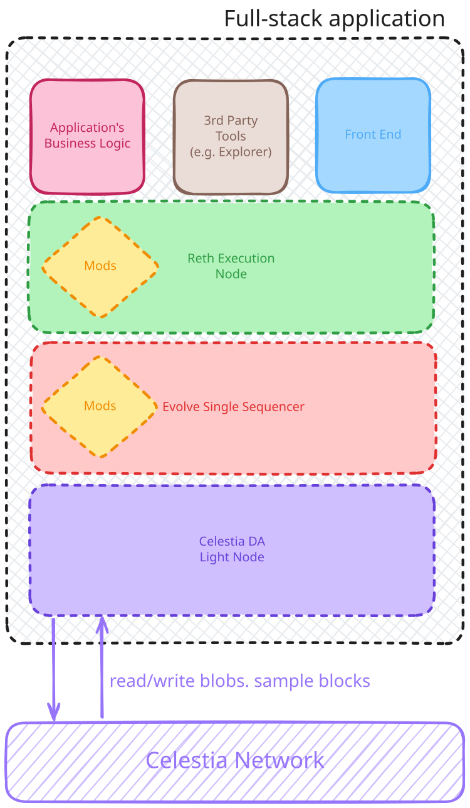

# Evolve Taller - Full Stack dApp with RWA Contracts

This project provides a complete development environment for a full-stack decentralized application (dApp) running on a sovereign rollup. It includes a React-based frontend, Solidity smart contracts for Real World Assets (RWAs), and a local rollup stack using Evolve, Celestia, and Reth.

## Architecture

The stack consists of the following components:

-   **Frontend**: A React application for interacting with the smart contracts.
-   **Smart Contracts**: Solidity contracts for creating and managing RWAs.
-   **Rollup**:
    -   **Evolve (Rollkit)**: A sovereign rollup sequencer.
    -   **Celestia**: Data availability layer.
    -   **Reth**: Execution layer.
-   **Tooling**:
    -   **Tilt**: For orchestrating the development environment.
    -   **Foundry**: For Solidity development and deployment.



## Prerequisites

-   **Docker**: For running the services in containers.
-   **Tilt**: For running the development environment.
-   **Foundry**: For smart contract development.
-   **Node.js and npm**: For frontend development.

## Quick Start

1.  **Install Dependencies**:
    -   Install [Docker](https://docs.docker.com/get-docker/)
    -   Install [Tilt](https://docs.tilt.dev/install.html)
    -   Install [Foundry](https://book.getfoundry.sh/getting-started/installation)
    -   Install [Node.js and npm](https://nodejs.org/en/download/)

2.  **Start the Environment**:
    ```bash
    tilt up
    ```
    This command will:
    -   Start the Celestia, Reth, and Evolve services.
    -   Deploy the RWA smart contracts to the local rollup.
    -   Start the frontend development server.

3.  **Access the Services**:
    -   **Frontend**: [http://localhost:5173](http://localhost:5173)
    -   **Reth RPC**: [http://localhost:8545](http://localhost:8545)
    -   **Celestia RPC**: [http://localhost:26658](http://localhost:26658)
    -   **Evolve RPC**: [http://localhost:7331](http://localhost:7331)
    -   **Tilt Dashboard**: [http://localhost:10350](http://localhost:10350)

## Development

### Smart Contracts

The smart contracts are located in the `rwa-soberano-evolve/` directory. You can use Foundry to build, test, and deploy the contracts.

-   **Build**: `forge build`
-   **Test**: `forge test`

The contracts are automatically deployed by Tilt when you run `tilt up`.

### Frontend

The frontend application is located in the `frontend/` directory. It is a React application built with Vite.

-   **Install Dependencies**: `npm install`
-   **Run Development Server**: `npm run dev`

The frontend is automatically started by Tilt when you run `tilt up`.

## Stopping the Environment

To stop all the services, run:

```bash
tilt down
```
